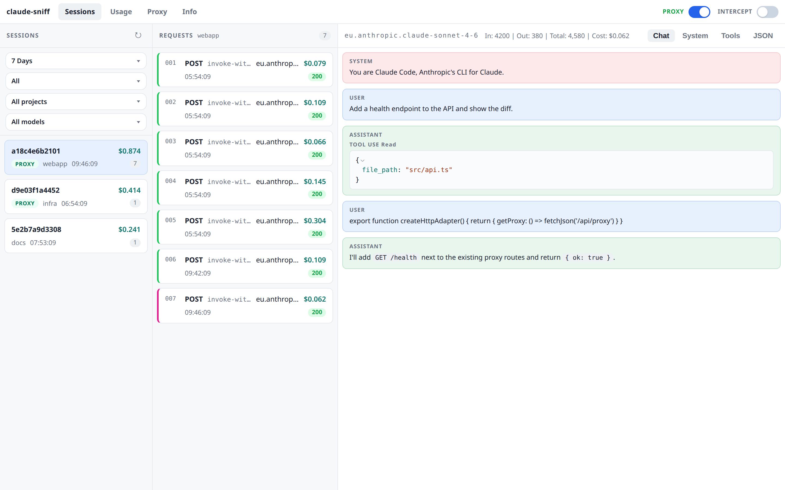
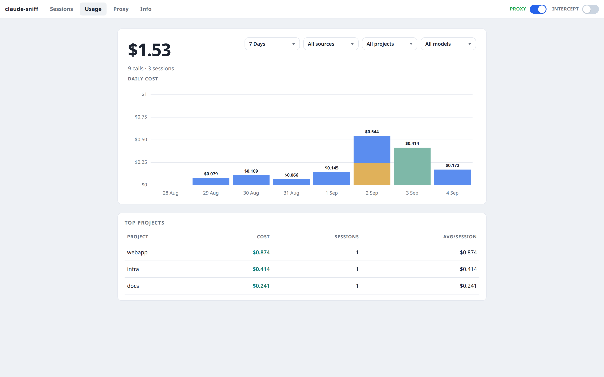
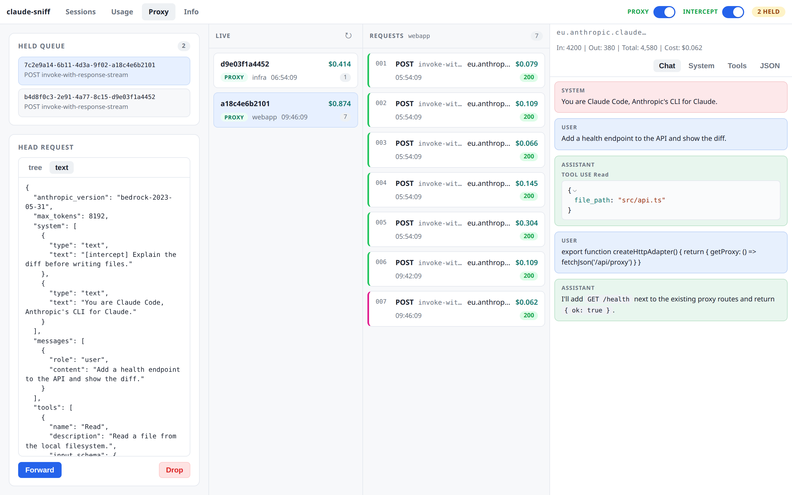

# claude-sniff

Loopback MITM for **Claude Code on Amazon Bedrock**: sniff invokes, hold/edit the JSON, Forward (SigV4 re-sign) or Drop. One listener, one UI, no `run` wrapper.

This is not `ANTHROPIC_BASE_URL=localhost`. Claude Code on Bedrock does not speak that.

Proxy and Intercept start **off** and are not persisted.





Edited hold, then Forward or Drop:



## Prerequisites

- Python 3.12+ and [uv](https://docs.astral.sh/uv/)
- Claude Code with `CLAUDE_CODE_USE_BEDROCK=1`
- AWS credentials in the process that runs `main.py` (`AWS_PROFILE`, SSO, or the default chain)

## Quick start

```bash
uv sync
uv run python main.py --aws-profile your-profile   # optional; same chain as AWS_PROFILE
```

Listener: `http://127.0.0.1:9090`. UI: `http://127.0.0.1:8765`. First run writes the mitmproxy CA to `~/.mitmproxy/mitmproxy-ca-cert.pem`.

**1. Pin every new Claude Code process** (it does not inherit exports from another shell):

```bash
export HTTP_PROXY=http://127.0.0.1:9090
export HTTPS_PROXY=http://127.0.0.1:9090
claude
```

With Proxy **off**, HTTPS is tunneled (Bedrock’s real cert, no CA). Usage still reads `~/.claude/projects`.

**2. Sniff:** in the UI, turn **Proxy** on. Then, in the same shell as `claude` (or copy from the Info page):

```bash
export NODE_EXTRA_CA_CERTS="$HOME/.mitmproxy/mitmproxy-ca-cert.pem"
export SSL_CERT_FILE="$HOME/.mitmproxy/mitmproxy-ca-cert.pem"
export REQUESTS_CA_BUNDLE="$HOME/.mitmproxy/mitmproxy-ca-cert.pem"
export AWS_CA_BUNDLE="$HOME/.mitmproxy/mitmproxy-ca-cert.pem"
```

Restart `claude` after the CA exports. Send a message. Sessions with `x-claude-code-session-id` land in `logs/<client>/<session-id>.jsonl`.

**3. Intercept:** Proxy page → **Intercept** on. Each Bedrock Runtime `invoke` / `invoke-with-response-stream` with `x-claude-code-session-id` is held. Edit the head JSON, then **Forward** or **Drop**.

- Untouched JSON → resumed as the original (no re-sign).
- Edited JSON → re-signed SigV4 from this process’s AWS chain (`--aws-profile` / `AWS_PROFILE` / SSO).
- Drop → client-visible error, JSONL error row, no Bedrock call.
- Global FIFO; only the head is editable. Turning Intercept or Proxy off flushes the queue as the original.

Trust the CA **only while Proxy is on**.

## Costs

EU regional on-demand (`eu-central-1`) in the sidebar and per request. Family from model-name keywords, or from account-scoped application-inference-profile ids (this repo ships none):

```bash
export CLAUDE_PROXY_INFERENCE_PROFILES='{"yourId":"sonnet-4.6"}'
```

or a gitignored `inference-profiles.json`. Journals: `~/.claude/projects` (`--claude-projects-dir`). Same UUID in `logs/` and the journal is shown once (MITM dollars win). Direct rows are cost-only, no chat. Unknown model/profile → `$0`. Pricing is read-time; logs are not rewritten with `costUSD`.

## Flags

| Flag | Default |
|---|---|
| `--port` | `9090` |
| `--ui-port` | `8765` |
| `--no-ui` | UI on |
| `--logs-dir` | `logs/` |
| `--claude-projects-dir` | `~/.claude/projects` |
| `--aws-profile` | process default chain |

```bash
uv run python main.py ui          # UI only, no MITM
```

`logs/` is gitignored. JSONL strips `Authorization` and `x-amz-security-token`; bodies (prompts, system) are stored as-is.

UI is served from `ui/dist`. Hot reload: keep `main.py` running, `cd ui && bun run dev`. Rebuild with `cd ui && bun install && bun run build` when shipping UI changes.

## If nothing shows up

- New `claude` after `HTTP(S)_PROXY` (and CA, if Proxy is on).
- TLS errors with Proxy on → CA exports missing or an old process without them.
- Empty Sessions with Proxy off → expected for chat; costs still come from journals.
- `$0` → unknown model/profile; map inference-profile ids.
- Intercept never holds → not a Bedrock `invoke`, or no `x-claude-code-session-id`.

## What it does not do

- Not a reverse proxy on `ANTHROPIC_BASE_URL`
- Does not mask request bodies
- Does not intercept or edit Bedrock responses
- Does not persist Proxy/Intercept toggles
- Does not ship request overlays or sample jailbreaks
